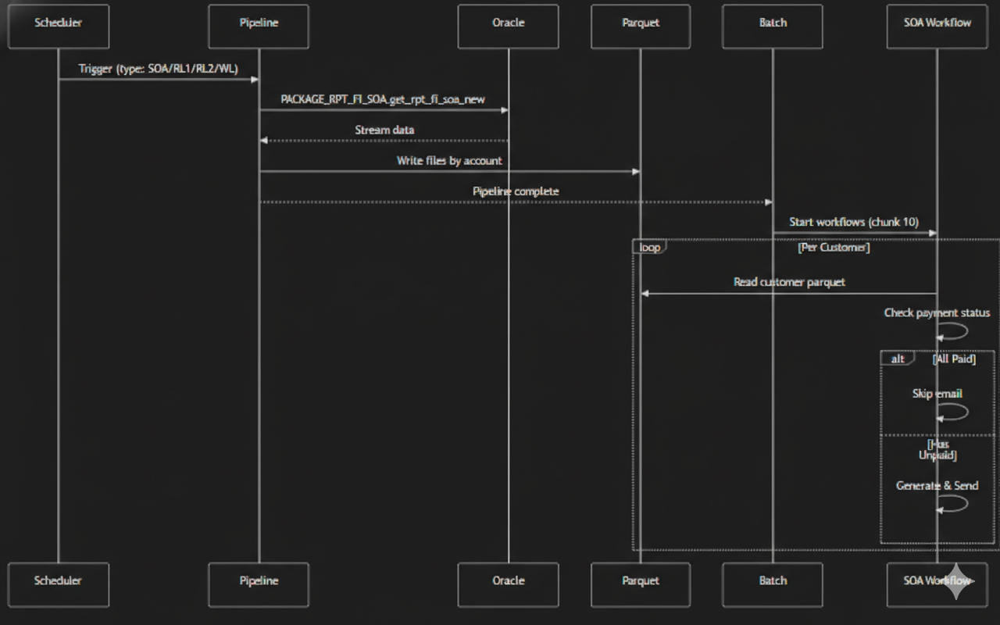

# SOA Finance Service

This service is a **Restate** application designed to handle the Statement of Account (SOA) and Reminder Letter generation pipeline. It uses **Durable Execution** to ensure reliability across complex distributed processes involving Oracle databases, data streaming, Parquet file processing, and external services like Azure Blob Storage and SendGrid.

## Project Structure

The project follows a domain-driven structure to separate concerns:

- **`src/data-pipeline/`**:
  - Handles high-performance data processing using **Apache Arrow** and **Parquet**.
  - Responsible for reading and processing large datasets efficiently.

- **`src/infrastructure/`**: External adapters and technical implementations.
  - `azure/`: Azure Blob Storage integration for uploading generated reports.
  - `database/`: Database queries and connection management (Oracle).
  - `email/`: Email sending service (SendGrid) and template management.
  - `gotenberg/`: Client for generating PDFs from HTML using Gotenberg.
  - `browser/`: Utilities for browser-based tasks (if applicable).

- **`src/module/`**: Core business logic.
  - **`workflows/`**: Orchestration logic defining the durable execution flows.
    - `BatchWorkflow`: Manages the high-level batch processing of all customers.
    - `SoaWorkflow`: Handles the end-to-end process for a single customer (Data extraction -> Generation -> Email).
  - **`services/`**: focused business logic and rules (e.g., `createReminder`, `generateSoa`).
  - **`handlers/`**: Atomic activities called by workflows (e.g., `generateSoaPdfHandler`).
  - **`utils/`**: Shared utilities for formatting, template rendering, and types.

## Prerequisites

- **[Bun](https://bun.sh/)**: Runtime and package manager.
- **[Docker](https://www.docker.com/)**: Required to run the Restate runtime and Gotenberg.
- **Environment Variables**: Create a `.env` file with the following keys:
  - `RESTATE_URL`: URL of the Restate server (default: `http://localhost:8080`).
  - `DATABASE_URL`: Oracle database connection string.
  - `AZURE_STORAGE_CONNECTION_STRING`: Azure Blob Storage connection.
  - `SENDGRID_API_KEY`: API key for sending emails.
  - `GOTENBERG_URL`: URL of the Gotenberg service (default: `http://localhost:3000`).

## Getting Started

### 1. Install Dependencies

```bash
bun install
```

### 2. Start Infrastructure

Run the required services (Restate, Gotenberg) using Docker Compose:

```bash
docker-compose up -d
```

- **Restate Admin**: http://localhost:9070
- **Gotenberg**: http://localhost:3000

### 3. Run the Service

Start the application in development mode with hot-reloading:

```bash
bun run dev
```

### 4. Register with Restate

Once the service is running, register it with the Restate runtime:

```bash
http://host.docker.internal:9080
```

## Workflows

### Batch Workflow

The entry point for processing SOAs. It:

1. Determines the processing date and period.
2. Fetches all active customers.
3. Creates a batch record.
4. Triggers `SoaWorkflow` for each customer in chunks to manage load.

### SOA Workflow

Processes an individual customer:

1. **GetSoa**: Fetches SOA data from Parquet/Database.
2. **Filter**: Applies aging and payment reconciliation filters.
3. **Generate**: Creates Excel and PDF reports (using Gotenberg).
4. **Upload**: Uploads files to Azure Blob Storage.
5. **Send**: Sends the SOA/Reminder email via SendGrid.

---

## Workflow SOA


